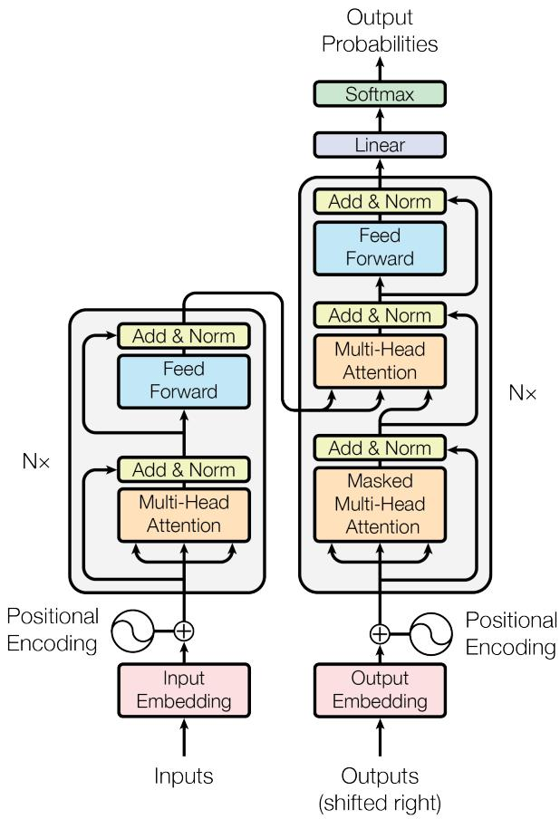
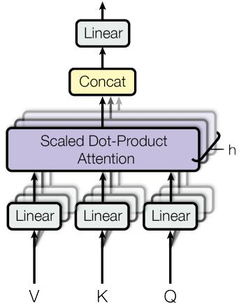
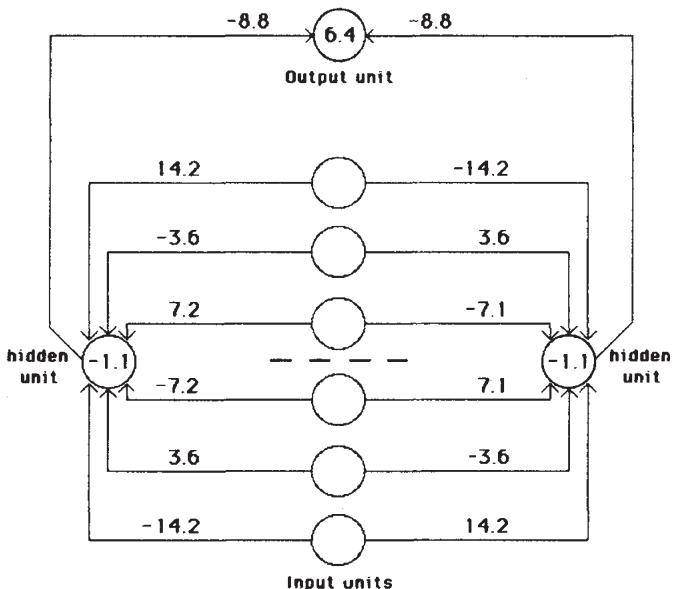
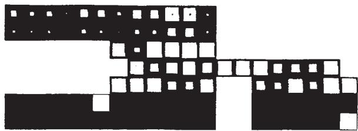
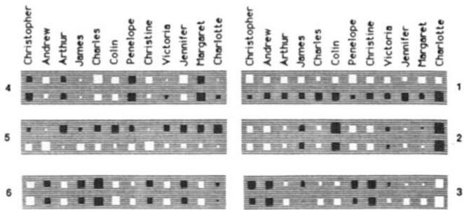

# Paper Collection — AI Foundational Works

This document summarizes two foundational papers in artificial intelligence, parsed via MinerU Precision API and analyzed by opencode omo sisyphus agent. Each paper entry includes author backgrounds, article overview, key concepts explained, and detailed figure-by-figure descriptions with embedded images.

> **Processing notes**: All PDFs were parsed with MinerU Precision API (vlm backend, language=en). Figure descriptions are inferred from captions, surrounding text, and cross-references within the paper — not from pixel-level image reading. Provenance tags: `[FROM CAPTION]` = verbatim from figure caption, `[FROM TEXT]` = from body paragraphs discussing the figure, `[INFERRED]` = deduced from context without direct textual support.

---

## 1. Attention Is All You Need

### Bibliographic Information

- **Title**: Attention Is All You Need
- **Venue**: Advances in Neural Information Processing Systems (NeurIPS) 2017
- **Authors**: Ashish Vaswani, Noam Shazeer, Niki Parmar, Jakob Uszkoreit, Llion Jones, Aidan N. Gomez, Łukasz Kaiser, Illia Polosukhin
- **Citation count**: 150,000+ (as of 2026, one of the most cited papers in AI history)

### Author Information

| Author                   | Affiliation (at publication) | Background & Academic Circle                                                                                                                                                                                                                                                                                                                                                                                                                                                                                                         |
| ------------------------ | ---------------------------- | ------------------------------------------------------------------------------------------------------------------------------------------------------------------------------------------------------------------------------------------------------------------------------------------------------------------------------------------------------------------------------------------------------------------------------------------------------------------------------------------------------------------------------------ |
| **Ashish Vaswani**\*     | Google Brain                 | PhD in Computer Science from **USC** (2014). Staff Research Scientist at Google Brain (2016–2021) where the Transformer work was done. Later co-founded **Adept AI Labs** (2022, Chief Scientist) and **Essential AI** (2023, CEO), building enterprise AI tools backed by Google, Nvidia, and AMD. [Wikipedia](https://en.wikipedia.org/wiki/Ashish_Vaswani)                                                                                                                                                                        |
| **Noam Shazeer**\*       | Google Brain                 | Studied at **Duke University** (1994–1998). Joined Google in 2000, wrote the spelling corrector for Google Search and the PHIL algorithm powering AdSense. At Google Brain, designed the Transformer's multi-head attention mechanism, the residual architecture, and the first working implementation. Co-authored T5, LaMDA, Mixture of Experts. Co-founded **Character.AI** (2021, CEO); returned to Google (Aug 2024) as **VP Engineering and Gemini Co-Lead** at Google DeepMind. [Personal site](https://www.noamshazeer.com/) |
| **Niki Parmar**\*        | Google Research              | BE from Pune Institute of Computer Technology, MS in CS from **USC**. Joined Google Research (2015), Google Brain (2017) — the youngest and only non-PhD co-author. Co-authored Image Transformer, Conformer (speech recognition), and stand-alone self-attention for vision. Co-founded **Adept AI** (CTO, 2021), **Essential AI** (2023). As of Jan 2025, Member of Technical Staff at **Anthropic**. [The Org](https://theorg.com/org/anthropic/org-chart/niki-parmar)                                                            |
| **Jakob Uszkoreit**\*    | Google Research              | German computer scientist, MS from **Technische Universität Berlin** (2007). Joined Google 2008 working on Google Translate; 13 years at Google Brain building language understanding for the Google Assistant. Co-founded **Inceptive** (2021) using deep learning and high-throughput biochemistry for RNA-based drug design. [Personal site](http://jakob.uszkoreit.net/)                                                                                                                                                         |
| **Llion Jones**\*        | Google Research              | British researcher, BSc in AI & CS and MSc in Advanced CS from **University of Birmingham**. Over a decade at Google Research Tokyo (2015–2023). Co-founded **Sakana AI** (2023, CTO), a Tokyo-based startup developing nature-inspired, non-Transformer AI architectures. [TEDAI SF](https://tedai-sanfrancisco.ted.com/panelists/2025/llion-jones/)                                                                                                                                                                                |
| **Aidan N. Gomez**\* †   | University of Toronto        | Canadian, BS in CS from UToronto (supervised by Roger Grosse), PhD from **University of Oxford** (supervised by Yarin Gal and Yee Whye Teh). Google Brain intern in 2017 at age ~20 when he co-authored the paper. Co-founded **Cohere** (2019, CEO), a leading enterprise LLM company. Sits on the Board of Directors for **Rivian**. [Personal site](https://aidangomez.ca/)                                                                                                                                                       |
| **Łukasz Kaiser**\*      | Google Brain                 | Polish researcher, PhD from **RWTH Aachen** (2008), MSc from University of Wrocław. Tenured researcher at University Paris Diderot (logic and automata theory) before joining Google Brain (2013–2021), co-authoring TensorFlow, Tensor2Tensor, Trax. Now Senior Research Scientist at **OpenAI**, co-invented reasoning models (o1, o3), GPT-4, GPT-5. [Stanford NLP](https://nlp.stanford.edu/seminar/details/lkaiser.shtml)                                                                                                       |
| **Illia Polosukhin**\* ‡ | Google Research              | Ukrainian-born, studied at Kharkiv Polytechnic Institute. Google (2014–2017) as major **TensorFlow** contributor, managed question-answering for Google Search. Co-founded **NEAR Protocol**, a sharded proof-of-stake blockchain platform (mainnet 2020), where he serves as CTO, now building decentralized AI infrastructure. [Wikipedia](https://en.wikipedia.org/wiki/Illia_Polosukhin)                                                                                                                                         |

\* Equal contribution. † Work performed during an internship at Google Brain. ‡ Work performed when at Google Research.

**Collaboration circle**: This paper emerged from the Google Brain machine translation team in Mountain View, which had previously produced the GNMT system [38] and the Tensor2Tensor training framework. The authors' later trajectories show a diaspora into major AI companies (Character.AI, Cohere, Adept AI, Sakana AI, Inceptive) and even adjacent fields (NEAR Protocol in blockchain), illustrating the outsized impact of this single collaboration.

### Article Overview

The paper introduces the **Transformer**, a neural network architecture that replaces recurrent and convolutional layers entirely with a self-attention mechanism. The Transformer processes all positions in a sequence simultaneously (non-sequentially), enabling massive parallelization during training. On the WMT 2014 English-to-German translation task, the Transformer achieved 28.4 BLEU (a 2+ BLEU improvement over all previous models, including ensembles). On English-to-French, it reached 41.8 BLEU with only 3.5 days of training on 8 GPUs. The paper also demonstrated that the Transformer generalizes to English constituency parsing, showing the architecture is not limited to translation.

### Keywords

- **Self-Attention** — A mechanism that computes a weighted representation of an input sequence by comparing each position to all other positions in the sequence, capturing global dependencies in $O(1)$ sequential operations.
- **Multi-Head Attention** — Running multiple attention operations (heads) in parallel on different learned linear projections of the same inputs, allowing the model to attend to different representation subspaces simultaneously.
- **Positional Encoding** — Since the Transformer has no recurrence or convolution, it injects sequence-order information by adding sinusoidal functions (sine/cosine waves of varying frequencies) to input embeddings.
- **Encoder-Decoder Architecture** — The encoder maps an input sequence to continuous representations; the decoder generates output tokens one-at-a-time, autoregressively, attending to the encoder output at each step.
- **Scaled Dot-Product Attention** — The specific attention variant used: dot-product of query and key vectors, scaled by $1/\sqrt{d_k}$ to prevent large dot products from saturating the softmax.
- **Residual Connections & Layer Normalization** — Architectural techniques used after each sub-layer: $\text{LayerNorm}(x + \text{Sublayer}(x))$, enabling stable training of deep networks.

### Key Concepts Explained

#### 1. Why Replace Recurrence?

Recurrent networks (LSTMs, GRUs) process sequences step-by-step: the hidden state at time $t$ depends on the hidden state at time $t-1$. This creates a sequential bottleneck — each position must wait for the previous one to complete, preventing parallelization. The Transformer breaks this by computing attention between all positions simultaneously. As Table 1 shows, recurrent layers require $O(n)$ sequential operations ($n$ = sequence length), while self-attention requires $O(1)$. This makes training dramatically faster for long sequences. `(§1 Introduction; §3.2 Attention)`

#### 2. The Attention Mechanism (Mathematical Intuition)

Attention is a differentiable key-value lookup. Each "query" vector $Q$ is compared against all "key" vectors $K$ via dot product. The resulting scores are scaled and softmax-normalized to produce attention weights, which then weight the "value" vectors $V$. The formula (Equation 1):

$$
\text{Attention}(Q, K, V) = \text{softmax}\left(\frac{QK^T}{\sqrt{d_k}}\right)V \tag{1}
$$

The scaling factor $\sqrt{d_k}$ is critical: without it, large $d_k$ values produce very large dot products, pushing the softmax into regions of extremely small gradients (the authors note that additive attention outperforms unscaled dot-product attention for large $d_k$). `(§3.2.1 Scaled Dot-Product Attention)`

#### 3. Multi-Head Attention: Why 8 Heads?

Instead of a single attention operation with full-dimensionality keys/values/queries, the authors project inputs $h=8$ times with different learned projections to lower-dimensional subspaces ($d_k = d_v = 64$, where $d_{\text{model}} = 512$). Each head attends to different aspects of the input. For example, some heads focus on syntactic relations, others on long-distance dependencies, others on anaphora (pronoun resolution). The head outputs are concatenated and linearly projected back. This is computationally similar to single-head attention (since dimensions per head are reduced proportionally) but qualitatively richer. `(§3.2.2 Multi-Head Attention)`

$$
\text{MultiHead}(Q, K, V) = \text{Concat}(\text{head}_1, \ldots, \text{head}_h) W^O
$$

$$
\text{where } \text{head}_i = \text{Attention}(QW_i^Q, KW_i^K, VW_i^V)
$$

#### 4. Positional Encoding: Sine Waves as Position Signals

Without recurrence, the model has no inherent sense of token order. The authors add sinusoidal positional encodings directly to input embeddings:

$$
PE_{(pos, 2i)} = \sin(pos / 10000^{2i/d_{\text{model}}})
$$

$$
PE_{(pos, 2i+1)} = \cos(pos / 10000^{2i/d_{\text{model}}})
$$

Each dimension corresponds to a sinusoid of a different frequency (wavelengths from $2\pi$ to $10000 \cdot 2\pi$). The key insight: for any fixed offset $k$, $PE_{pos+k}$ can be expressed as a linear function of $PE_{pos}$ (using trigonometric identities), which hypothetically helps the model learn to attend by relative position. Learned positional embeddings performed similarly in experiments. `(§3.5 Positional Encoding)`

#### 5. Residual Dropout and Label Smoothing

The paper employs two regularization techniques. **Residual Dropout** (rate 0.1 for base model): dropout is applied to the output of each sub-layer before it is added to the residual connection (i.e., before $\text{LayerNorm}(x + \text{Dropout}(\text{Sublayer}(x)))$). Dropout is also applied to the sum of embeddings and positional encodings. **Label Smoothing** ($\epsilon_{ls} = 0.1$): instead of training on hard 0/1 targets, the model learns to predict slightly softened distributions. This hurts training perplexity (the model becomes less "confident") but improves BLEU scores because it prevents overconfidence. `(§5.4 Regularization)`

#### 6. Training Regime and Scale

- **Data**: WMT 2014 English-German (4.5M sentence pairs, byte-pair encoded with 37K shared vocabulary); English-French (36M sentences, 32K word-piece vocabulary).
- **Hardware**: 8 NVIDIA P100 GPUs, 12 hours for base model, 3.5 days for big model.
- **Optimizer**: Adam with a custom learning rate schedule (linear warmup for 4000 steps, then inverse square root decay):

$$
lrate = d_{\text{model}}^{-0.5} \cdot \min(step\_num^{-0.5}, step\_num \cdot warmup\_steps^{-1.5}) \tag{3}
$$

- The paper estimates training cost in FLOPs, showing the Transformer is ~50× cheaper to train than comparable recurrent models (Table 2). `(§5 Training)`

### Tables

#### Table 1 — Computational Complexity Comparison

| Layer Type                  | Complexity per Layer     | Sequential Ops | Max Path Length |
| --------------------------- | ------------------------ | -------------- | --------------- |
| Self-Attention              | $O(n^2 \cdot d)$         | $O(1)$         | $O(1)$          |
| Recurrent                   | $O(n \cdot d^2)$         | $O(n)$         | $O(n)$          |
| Convolutional               | $O(k \cdot n \cdot d^2)$ | $O(1)$         | $O(\log_k(n))$  |
| Self-Attention (restricted) | $O(r \cdot n \cdot d)$   | $O(1)$         | $O(n/r)$        |

`[FROM TABLE]` This table justifies the Transformer's architectural choice. Self-attention achieves constant path length between any two positions (best for long-range dependency learning) and constant sequential operations (best for parallelization), at the cost of quadratic complexity in sequence length. `(§4 Why Self-Attention)`

#### Table 2 — BLEU Scores and Training Cost

`[FROM TABLE]` The Transformer (big) achieves 28.4 BLEU on EN-DE (previous best ensemble: 26.36) and 41.8 BLEU on EN-FR (previous best single model: 40.56 from ConvS2S with Mixture-of-Experts). The base Transformer model's training cost ($3.3 \times 10^{18}$ FLOPs) is roughly 1/50th that of the best ensemble model. `(§6.1 Machine Translation)`

#### Table 3 — Architecture Variations (Ablation Study)

`[FROM TABLE, §6.2]` Rows (A): Varying number of attention heads while keeping total computation constant. Single-head attention ($h=1$, $d_k=512$) is 0.9 BLEU worse than the 8-head base model, confirming the benefit of multi-head. Too many heads ($h=32$, $d_k=16$) also degrades quality. Rows (B): Reducing attention key dimension $d_k$ hurts performance. Rows (C) and (D): Bigger models (more layers, wider dimensions) improve BLEU. Dropout is essential — without it, larger models overfit. Row (E): Learned positional embeddings perform nearly identically to sinusoidal ones.

#### Table 4 — Constituency Parsing Results

`[FROM TABLE, §6.3]` The 4-layer Transformer achieves 91.3 F1 on WSJ Section 23 with only the WSJ training set, outperforming the Berkeley Parser (90.4). In the semi-supervised setting (17M additional sentences), it reaches 92.7 F1, approaching the Recurrent Neural Network Grammar (93.3). This demonstrates the Transformer generalizes beyond translation.

### Figures — Detailed Explanations

#### Figure 1: The Transformer — Model Architecture

**Caption** `[FROM CAPTION]`: "Figure 1: The Transformer — model architecture."

**Analysis** `[INFERRED from text §3, §3.1]`: This is the iconic architecture diagram of the paper. The left half shows the Encoder stack and the right half shows the Decoder stack, connected by cross-attention arrows.

The **Encoder** (left): Input tokens pass through an embedding layer, then through positional encoding, then through $N=6$ identical layers. Each encoder layer has two sub-layers: (1) Multi-Head Self-Attention, and (2) Feed-Forward Network. Both sub-layers are wrapped in residual connections followed by layer normalization: $\text{LayerNorm}(x + \text{Sublayer}(x))$.

The **Decoder** (right): Similarly, $N=6$ identical layers, but each has three sub-layers: (1) Masked Multi-Head Self-Attention (masked to prevent attending to future positions), (2) Multi-Head Cross-Attention over the encoder output, and (3) Feed-Forward Network. The output then passes through a linear layer and softmax to produce token probabilities.

The diagram uses color coding to show data flow: embedding vectors at bottom, intermediate representations flowing upward through layers, residual connections (bypass arrows), and the cross-attention connection from encoder to decoder.

**Key detail from text** `[FROM TEXT §3.1]`: All sub-layers produce outputs of dimension $d_{\text{model}} = 512$. The decoder's self-attention is masked (future positions are set to $-\infty$ before softmax) to maintain the autoregressive property — predictions for position $i$ can only depend on known outputs at positions $< i$.

**Uncertainty**: Without reading the pixels, the exact visual layout (positions of boxes, colors, arrow directions, labels inside sub-layer boxes) cannot be confirmed. The presence of "Add & Norm" labels near residual connections is inferred from the text description.

---

#### Figure 2: Scaled Dot-Product Attention and Multi-Head Attention

**Caption** `[FROM CAPTION]`: "Figure 2: (left) Scaled Dot-Product Attention. (right) Multi-Head Attention consists of several attention layers running in parallel."

**Left Panel — Scaled Dot-Product Attention** `[INFERRED from §3.2.1]`:
This is a computational graph with three inputs ($Q$, $K$, $V$) at the bottom feeding upward. The operation sequence is:
1. **MatMul**: $Q$ and $K$ are matrix-multiplied (dot product)
2. **Scale**: Result is divided by $\sqrt{d_k}$
3. **Mask** (opt.): For decoder self-attention, future positions are masked to $-\infty$
4. **SoftMax**: Converts scores to probability weights
5. **MatMul**: Weighted sum with $V$ produces the output

**Right Panel — Multi-Head Attention** `[INFERRED from §3.2.2]`:
This shows $h$ parallel "Scaled Dot-Product Attention" blocks (the left panel repeated horizontally $h=8$ times), each receiving its own linearly projected versions of $Q$, $K$, $V$. The flow:
1. $V$, $K$, $Q$ enter at the bottom
2. Each passes through $h$ separate **Linear** projections (learned weight matrices $W_i^Q, W_i^K, W_i^V$)
3. Each projected triple feeds into a separate **Scaled Dot-Product Attention** block
4. The $h$ outputs are **Concat**enated
5. A final **Linear** projection ($W^O$) produces the output

**Key detail from text** `[FROM TEXT §3.2.2]`: The dimension per head is $d_k = d_v = d_{\text{model}} / h = 64$ (with $d_{\text{model}} = 512$ and $h = 8$). This ensures the total computational cost stays similar to single-head attention.

**Cross-reference**: Figure 2's attention mechanism is used in three ways in the Transformer: encoder self-attention, decoder self-attention (masked), and encoder-decoder cross-attention. `(§3.2.3)`

> **Appendix Figures 3–5 (not shown)**: The paper's appendix includes three attention visualization figures demonstrating that individual attention heads learn interpretable linguistic functions — long-distance dependency resolution (Figure 3), anaphora resolution (Figure 4), and syntactic structure detection (Figure 5). These appear after the references in the original paper. See the MinerU output images at `mineru/attention-is-all-you-need/images/` for the extracted visualizations.

---

## 2. Learning Representations by Back-Propagating Errors

### Bibliographic Information

- **Title**: Learning representations by back-propagating errors
- **Venue**: Nature, Volume 323, Issue 6088, pages 533–536
- **Date**: Published 9 October 1986 (received 1 May, accepted 31 July 1986)
- **Authors**: David E. Rumelhart\*, Geoffrey E. Hinton†, Ronald J. Williams\*
- **DOI**: [10.1038/323533a0](https://doi.org/10.1038/323533a0)

\* Institute for Cognitive Science, University of California, San Diego (UCSD)
† Department of Computer Science, Carnegie-Mellon University (CMU)

> **Parse quality note**: The MinerU parsing of this PDF contained text from adjacent Nature articles before and after the back-propagation paper. The back-propagation paper was a 4-page "Letter" in Nature, occupying pages 533–536. In the Nature print layout, the "Letters to Nature" section packed multiple letters onto the same physical page — page 536 shared the bottom portion with a geochemistry paper about amino acid racemization dating of fossil bones. When this page was scanned/photocopied into a PDF, both papers were captured. The front noise (lines 1–56 of `full.md`) contains references to Bada, Engel, and Macko (geochemists, not neural network researchers). The back noise (lines 291–344) is from a neuroscience paper about bilateral amblyopia in kittens by Murphy & Mitchell. The actual back-propagation content begins at line 57 and ends around line 289. The analysis below focuses exclusively on the back-propagation content.
>
> **Important distinction**: The authors also published a much longer (45-page) chapter titled "Learning Internal Representations by Error Propagation" in the PDP book (MIT Press, 1986, pp. 318–362). That chapter includes XOR problem experiments with additional network diagrams (XOR architecture, learned XOR weights, local minimum visualization) that are **not** in the Nature paper. The Nature paper is a condensed version featuring the symmetry detection, family tree, and recurrent network equivalence experiments instead. The five figures below correspond to the Nature paper only.
>
> **Historical priority note**: The core mathematical technique (reverse-mode automatic differentiation / chain rule through computational graphs) was independently discovered multiple times. Seppo Linnainmaa published the reverse mode of automatic differentiation in his 1970 Master's thesis. Paul Werbos proposed applying it to neural networks in his 1974 Harvard PhD thesis. The Rumelhart-Hinton-Williams paper is historically significant because it demonstrated the practical effectiveness of the technique on interesting problems and was published in Nature, reaching a wide scientific audience — effectively triggering the "connectionist revolution" of 1986–1991.

### Author Information

| Author | Affiliation (at publication) | Background & Academic Circle |
|---|---|---|
| **David E. Rumelhart** (1942–2011)\* | Institute for Cognitive Science, UCSD | American psychologist, BA in psychology & math from University of South Dakota (1963), PhD in mathematical psychology from **Stanford** (1967). Faculty at UCSD then Stanford University. Independently developed backpropagation in spring 1982. Led the **Parallel Distributed Processing (PDP) research group** that catalyzed the connectionist revolution. Co-authored the landmark two-volume *PDP* (1986) with James McClelland. MacArthur Fellow (1987), member of the National Academy of Sciences. Notable PhD student: Michael I. Jordan. The annual **Rumelhart Prize** ($100,000) honors his legacy. Died 2011 from a progressive neurological condition. [Wikipedia](https://en.wikipedia.org/wiki/David_Rumelhart) |
| **Geoffrey E. Hinton** (b. 1947)† | Carnegie-Mellon University | British-Canadian, BA in Experimental Psychology from **Cambridge** (1970), PhD in AI from **Edinburgh** (1978). Postdoc at UCSD, faculty at CMU (1982–1987), then **University of Toronto** (1987–present, Emeritus). VP and Engineering Fellow at **Google** (2013–2023). Known as the "Godfather of AI." Contributions span Boltzmann machines, deep belief nets, dropout, AlexNet (2012 ImageNet breakthrough). **2018 ACM Turing Award** (with Bengio & LeCun) and **2024 Nobel Prize in Physics** (with John Hopfield). His academic descendants (Sutskever, LeCun, Krizhevsky, et al.) form the core of modern deep learning. Left Google in 2023 citing AI safety concerns. [UofT Bio](https://www.cs.utoronto.ca/~hinton/bio.html) |
| **Ronald J. Williams** (1945–2024)\* | Institute for Cognitive Science, UCSD | American mathematician, BS in math from **Caltech** (1966), PhD in math from **UCSD** (1975). Worked on anti-submarine warfare algorithms before joining Rumelhart's PDP group (1983–1986). Professor of Computer Science at **Northeastern University** (1986 onward). Foundational contributions: **REINFORCE algorithm** (1992) — the first policy gradient method in reinforcement learning, now foundational for RLHF in modern LLMs; teacher forcing (with Zipser); backpropagation through time. Died February 16, 2024, at age 79. [Wikipedia](https://en.wikipedia.org/wiki/Ronald_J._Williams) |

**Circle & context**: This work emerged from the Parallel Distributed Processing (PDP) research group centered at UC San Diego in the mid-1980s. The PDP group was a counter-movement to the symbolic AI approach dominant at the time (rule-based systems, expert systems). Rumelhart and McClelland's two-volume PDP book (1986) was the group's manifesto. The back-propagation paper is one of several landmark results from this group — others include the interactive activation model of word recognition and the development of Boltzmann machines by Hinton and Sejnowski.

This paper was published as a brief "letter" in Nature — a format choice that gave it visibility far beyond the neural network community. Together with the PDP books, it triggered what is sometimes called the "connectionist revolution" of 1986–1991, which was briefly eclipsed in the mid-1990s by statistical machine learning (SVMs, graphical models) before deep learning's resurgence in the 2010s.

**Network connection**: The two paper groups are historically connected — Aidan Gomez (Transformer paper) was mentored by Geoffrey Hinton at Google Brain, and Hinton supervised Ilya Sutskever, who co-founded OpenAI, where Łukasz Kaiser now works as a senior research scientist co-inventing GPT-4, o1, and o3.

### Article Overview

The paper describes the **back-propagation learning algorithm** for multi-layer neural networks. The key problem it solves is: how should weights be adjusted in networks with hidden units — units whose desired output states are not specified by the training data? The algorithm works in two phases. In the **forward pass**, input signals propagate layer-by-layer through the network to produce an output. In the **backward pass**, the error between actual and desired outputs is computed and then propagated backward through the network using the chain rule of calculus, computing partial derivatives of the error with respect to each weight. Weights are then adjusted by gradient descent:

$$\Delta w = -\varepsilon \frac{\partial E}{\partial w} \tag{8}$$

Optionally with a momentum term:

$$\Delta w(t) = -\varepsilon \frac{\partial E}{\partial w}(t) + \alpha \Delta w(t-1) \tag{9}$$

The paper demonstrates the algorithm on three tasks:
1. **Mirror symmetry detection** — a problem that requires hidden units because input features alone provide no evidence about symmetry.
2. **Family tree knowledge representation** — learning relations (father, mother, aunt, etc.) from triples, demonstrating that hidden units develop meaningful distributed representations of the domain structure.
3. **Mapping to recurrent/iterative networks** — showing how the layered back-propagation procedure can be adapted for recurrent networks.

### Keywords

- **Back-Propagation** — An algorithm for computing the gradient of an error function with respect to network weights by recursively applying the chain rule from output layer to input layer.
- **Hidden Units** — Neurons in intermediate layers whose target states are not specified by training data. They learn to represent useful features of the input domain.
- **Gradient Descent** — An optimization method that adjusts weights in the direction of steepest decrease in the error function.
- **Error Surface** — The multidimensional landscape of error as a function of all network weights. Gradient descent navigates this surface; local minima are potential pitfalls.
- **Momentum** — An acceleration technique ($\Delta w(t) = -\varepsilon \partial E/\partial w + \alpha \Delta w(t-1)$) that smooths weight changes and helps escape shallow local minima.
- **Distributed Representations** — Rather than using one unit per concept (local representation), concepts are encoded as patterns of activity across multiple units. Hidden units in the family tree task learn distributed features like "generation" and "family branch."
- **The Generalized Delta Rule** — The weight update rule for multi-layer networks, generalizing the delta rule (Widrow-Hoff) for single-layer perceptrons.

### Key Concepts Explained

#### 1. The Problem with Hidden Units

In a perceptron (single-layer network), input units connect directly to output units, and the desired states of all units are known. Learning is straightforward: adjust weights proportional to $(\text{desired} - \text{actual}) \times \text{input}$. However, when intermediate (hidden) layers exist, we do not know what hidden unit activations *should* be for a given input. The hidden units develop their own representations — but we need a way to assign credit/blame for the output error back to these hidden units. `(§1, Introduction paragraph)`

#### 2. The Chain Rule Solution

The breakthrough is applying the chain rule of calculus. For each weight $w_{ji}$ connecting unit $i$ to unit $j$:

$$\frac{\partial E}{\partial w_{ji}} = \frac{\partial E}{\partial x_j} \cdot \frac{\partial x_j}{\partial w_{ji}} = \frac{\partial E}{\partial x_j} \cdot y_i \tag{6}$$

Where $\partial E / \partial x_j$ (the error derivative with respect to unit $j$'s total input) can be computed:
- For output units: 

$$\partial E / \partial x_j = (y_j - d_j) \cdot y_j (1 - y_j) \tag{5}$$

- For hidden units: 

$$\partial E / \partial y_i = \sum_j \left( \partial E / \partial x_j \cdot w_{ji} \right) \tag{7}$$

The key insight of Equation 7: the error derivative for a hidden unit is the **weighted sum of the error derivatives of the units it connects to**, multiplied by the connection weights. This allows error to be propagated backward layer by layer. `(§Backward pass, Equations 4–7)`

#### 3. The Sigmoid Nonlinearity

The paper uses the logistic sigmoid function: 

$$y_j = \frac{1}{1 + e^{-x_j}} \tag{2}$$

This is crucial because:
- It is differentiable (required for gradient computation)
- Its derivative has a simple form: $dy/dx = y(1-y)$, which makes computation efficient (Equation 5)
- It is bounded between 0 and 1, preventing activations from growing unbounded

The authors note: "It is not necessary to use exactly the functions given in equations (1) and (2). Any input-output function which has a bounded derivative will do." This foreshadows the later use of tanh, ReLU, and other activation functions.

#### 4. The Forward Pass

The total input, $x_j$, to unit $j$ is a linear function of the outputs, $y_i$, of the units that are connected to $j$ and of the weights, $w_{ji}$, on these connections:

$$x_j = \sum_i y_i w_{ji} \tag{1}$$

Units can be given biases by introducing an extra input to each unit which always has a value of 1. The weight on this extra input is called the bias and is equivalent to a threshold of the opposite sign. `(§Forward pass)`

#### 5. The Error Function

The total error, $E$, is defined as:

$$E = \frac{1}{2} \sum_c \sum_j (y_{j,c} - d_{j,c})^2 \tag{3}$$

where $c$ is an index over cases (input-output pairs), $j$ is an index over output units, $y$ is the actual state of an output unit and $d$ is its desired state. The factor of $1/2$ is for mathematical convenience (it cancels when differentiating the square). `(§Error function)`

#### 6. Momentum and Batch vs. Online Learning

The paper describes two weight-update strategies:
- **Online**: Update weights after every training case. "No separate memory is required for the derivatives."
- **Batch**: Accumulate $\partial E / \partial w$ over all cases, then change weights once. This is what the experiments use.

The momentum acceleration (Equation 9) is presented as significantly improving convergence "without sacrificing the simplicity and locality" of gradient descent. With momentum ($\alpha \approx 0.9$), the current gradient modifies the velocity of the weight update rather than the position, enabling faster convergence through ravines in the error surface. `(§Backward pass, Equations 8–9)`

#### 7. Why Back-Propagation Matters (Then and Now)

At the time of publication (1986), the paper addressed a central criticism of neural networks: that multi-layer networks could not be trained because there was no learning rule for hidden units. Minsky and Papert's 1969 book "Perceptrons" had mathematically proved the limitations of single-layer networks and argued that there was "no reason to suppose" multi-layer networks could be trained. The back-propagation algorithm provided the missing learning rule, directly addressing the Minsky-Papert critique.

The specific technique — gradient descent through the chain rule — is now the foundation of virtually all deep learning. Modern frameworks like PyTorch and TensorFlow implement automatic differentiation, which is the computational generalization of back-propagation to arbitrary computational graphs.

#### 8. Local Minima: The "Surprisingly Rare" Barrier

The paper candidly acknowledges the main theoretical concern: "the error-surface may contain local minima so that gradient descent is not guaranteed to find a global minimum." However, the authors' empirical observation is striking: "experience with many tasks shows that the network very rarely gets stuck in poor local minima." They hypothesize that adding more connections creates extra dimensions in weight-space that "provide paths around the barriers." This empirical observation was remarkably prescient — the effective absence of problematic local minima in overparameterized networks is now a major research topic in deep learning theory (the "loss landscape" literature). `(§Conclusion paragraph)`

#### 9. The Biologically Plausible Question

The paper is honest: "The learning procedure, in its current form, is not a plausible model of learning in brains." The backward pass requires the same weights as the forward pass (weight symmetry), and the error derivatives must be computed with mathematical precision. However, the authors frame back-propagation as a proof of concept: "this suggests that it is worth looking for more biologically plausible ways of doing gradient descent in neural networks." This careful distinction between engineering effectiveness and biological plausibility was important for the paper's reception in the cognitive science community. `(§Final paragraph)`

### Figures — Detailed Explanations

#### Figure 1: Mirror Symmetry Detection Network

**Caption** `[FROM CAPTION]`: "Fig. 1 A network that has learned to detect mirror symmetry in the input vector. The numbers on the arcs are weights and the numbers inside the nodes are biases. The learning required 1,425 sweeps through the set of 64 possible input vectors, with the weights being adjusted on the basis of the accumulated gradient after each sweep. The values of the parameters in equation (9) were $\varepsilon = 0.1$ and $\alpha = 0.9$. The initial weights were random and were uniformly distributed between $-0.3$ and $0.3$."

**Analysis** `[FROM CAPTION + surrounding text]`: This figure shows a small neural network with input units (an array representing a binary vector), two hidden units, and one output unit. The key insight is how the weights encode the symmetry detection logic.

The caption explains the elegant solution: "for a given hidden unit, weights that are symmetric about the middle of the input vector are equal in magnitude and opposite in sign." This means if a symmetric pattern is presented (e.g., left half mirrors right half), both hidden units receive zero net input from the input units. Because hidden units have negative biases, they both remain OFF. The output unit, with a positive bias, turns ON — signaling symmetry.

For non-symmetric patterns, one hidden unit receives non-zero input and turns ON, suppressing the output unit. The weights on each side of the midpoint are in the ratio 1:2:4, ensuring each of the 8 possible patterns above the midpoint sends a unique activation sum — "so the only pattern below the midpoint that can exactly balance this sum is the symmetrical one."

**Cross-reference** `[FROM TEXT §Results]`: This task was chosen because it cannot be solved by a single-layer network: "the activity in an individual input unit, considered alone, provides no evidence about the symmetry or non-symmetry of the whole input vector, so simply adding up the evidence from the individual input units is insufficient." "A more formal proof that intermediate units are required is given in ref. 2" (Minsky & Papert, Perceptrons, 1969).

---

#### Figure 2: Two Isomorphic Family Trees

**Caption** `[FROM CAPTION]`: "Fig. 2 Two isomorphic family trees. The information can be expressed as a set of triples of the form (person 1) (relationship) (person 2), where the possible relationships are {father, mother, husband, wife, son, daughter, uncle, aunt, brother, sister, nephew, niece}. A layered net can be said to 'know' these triples if it can produce the third term of each triple when given the first two. The first two terms are encoded by activating two of the input units, and the network must then complete the proposition by activating the output unit that represents the third term."

**Analysis** `[FROM CAPTION + surrounding text]`: This figure shows two family trees — one English (with names like Christopher, Penelope, Andrew, Christine, etc.) and one Italian (Roberto, Maria, Pierro, Francesca, etc.). The trees are structurally identical (isomorphic) but the specific individuals differ. The purpose is to test whether the network can learn the relational structure underlying both trees and generalize across them.

The network is trained on a subset of possible (person, relationship, ?) triples. For example, if trained on (Colin, has-mother, Victoria), the network should learn that Colin always has Victoria as mother. But critically, if the Italian tree has a structurally equivalent relationship (say, Alfonso has-mother Lucia), the network should also learn to generalize from the English structure to the Italian one.

---

#### Figure 3: Activity Levels After Learning

**Caption** `[FROM CAPTION]`: "Fig. 3 Activity levels in a five-layer network after it has learned. The bottom layer has 24 input units on the left for representing ⟨person 1⟩ and 12 input units on the right for representing the relationship. The white squares inside these two groups show the activity levels of the units. There is one active unit in the first group representing Colin and one in the second group representing the relationship 'has-aunt'. Each of the two input groups is totally connected to its own group of 6 units in the second layer. These groups learn to encode people and relationships as distributed patterns of activity. The second layer is totally connected to the central layer of 12 units, and these are connected to the penultimate layer of 6 units. The activity in the penultimate layer must activate the correct output units, each of which stands for a particular ⟨person 2⟩. In this case, there are two correct answers (marked by black dots) because Colin has two aunts. Both the input units and the output units are laid out spatially with the English people in one row and the isomorphic Italians immediately below."

**Analysis** `[FROM CAPTION]`: This is a detailed architectural diagram showing the 5-layer network used for the family tree task, with actual activity levels after training. The network architecture is:
- Layer 1 (input, bottom): 24 units for persons + 12 units for relationships = 36 input units
- Layer 2 (first hidden): Two groups of 6 units each (12 total), one group connected to person inputs, one to relationship inputs
- Layer 3 (central hidden): 12 units, fully connected from layer 2
- Layer 4 (penultimate): 6 units, connected to layer 5
- Layer 5 (output, top): Units for all 24 possible persons (12 English, 12 Italian)

The specific example shows: input = (Colin, has-aunt). Since Colin (in the English tree) has two aunts, the network activates both corresponding output units (marked with black dots). The spatial layout of English above Italian (both in input and output layers) is intentional — it allows visual inspection of whether the network is treating structurally equivalent people similarly.

---

#### Figure 4: Hidden Unit Receptive Fields (Weight Visualization)

**Caption** `[FROM CAPTION]`: "Fig. 4 The weights from the 24 input units that represent people to the 6 units in the second layer that learn distributed representations of people. White rectangles, excitatory weights; black rectangles, inhibitory weights; area of the rectangle encodes the magnitude of the weight. The weights from the 12 English people are in the top row of each unit. Unit 1 is primarily concerned with the distinction between English and Italian and most of the other units ignore this distinction. This means that the representation of an English person is very similar to the representation of their Italian equivalent. The network is making use of the isomorphism between the two family trees to allow it to share structure and it will therefore tend to generalize sensibly from one tree to the other. Unit 2 encodes which generation a person belongs to, and unit 6 encodes which branch of the family they come from."

**Training details** `[FROM CAPTION]`: "We trained the network for 1500 sweeps, using $\varepsilon = 0.005$ and $\alpha = 0.5$ for the first 20 sweeps and $\varepsilon = 0.01$ and $\alpha = 0.9$ for the remaining sweeps. To make it easier to interpret the weights we introduced 'weight-decay' by decrementing every weight by 0.2% after each weight change."

**Analysis** `[FROM CAPTION]`: This is the most interpretability-oriented figure in the paper, showing the weights connecting the 24 person-input units to 6 hidden units in the second layer. The key findings:

1. **Unit 1**: Encodes English vs. Italian nationality. "Most of the other units ignore this distinction." This means the hidden representation is nationality-invariant for the other features, allowing cross-lingual generalization (e.g., learning from English tree data and applying to Italian tree data).

2. **Unit 2**: Encodes generation (which generation in the family tree a person belongs to).

3. **Unit 6**: Encodes family branch (which sub-family the person comes from, e.g., the Christopher/Penelope branch vs. the Andrew/Christine branch).

These features are "not at all explicit in the input and output encodings" — the input uses a localist "one unit per person" scheme, so these structured, compositional features emerged purely from learning. This is the central claim of the paper: that hidden units learn meaningful distributed representations.

**Cross-reference** `[FROM TEXT §Results]`: "Because the hidden features capture the underlying structure of the task domain, the network generalizes correctly to the four triples on which it was not trained."

**The weight-decay technique** `[FROM CAPTION]`: Weight decay (decrementing each weight by 0.2% after each update) was used for interpretability: "After prolonged learning, the decay was balanced by $\partial E/\partial w$, so the final magnitude of each weight indicates its usefulness in reducing the error." This is an early instance of what would later become L2 regularization in deep learning, used here for visualization rather than regularization.

---

#### Figure 5: Synchronous Iterative Net = Layered Net

**Caption** `[FROM CAPTION]`: "Fig. 5 A synchronous iterative net that is run for three iterations and the equivalent layered net. Each time-step in the recurrent net corresponds to a layer in the layered net. The learning procedure for layered nets can be mapped into a learning procedure for iterative nets."

**Analysis** `[FROM CAPTION + surrounding text]`: This figure demonstrates the equivalence between (a) a recurrent network run for 3 time steps, and (b) a feed-forward network with 3 layers. The key insight: you can "unroll" a recurrent network in time to create a layered network of the same depth, and then apply back-propagation to the unrolled network. This is the conceptual ancestor of **back-propagation through time** (BPTT), which would become the standard training algorithm for recurrent neural networks.

Two practical complications are identified:
1. "In an iterative net it is necessary to store the history of output states of each unit" — because the backward pass needs intermediate activations from the forward pass.
2. "Corresponding weights between different layers must have the same value" — the recurrent weights at each time step are shared. The solution: average $\partial E / \partial w$ across all corresponding weights, then apply the same update to each.

**Significance**: This mapping established that back-propagation could train recurrent networks, opening the door to sequence learning. The closing remark — "These nets can then either learn to perform iterative searches or learn sequential structures" — anticipates the RNN/LSTM sequence modeling that would dominate NLP for the next three decades, until the Transformer (Paper 1 in this collection) rendered recurrence unnecessary.

---

## Processing Metadata

- **Date processed**: 2026-05-25
- **Parser**: MinerU Precision API (vlm backend, language=en)
- **Agent**: opencode omo sisyphus
- **Source files**: 
  - `Attention Is All You Need.pdf` → `mineru/attention-is-all-you-need/full.md`
  - `Learning representations by back-propagating errors.pdf` → `mineru/backpropagation-1986/full.md`
- **Manifest**: `mineru/manifest.json`
- **Agent workflow**: `agent.md` in this directory
- **Total papers processed**: 2 / 2
