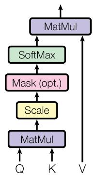
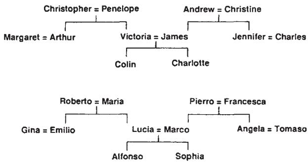
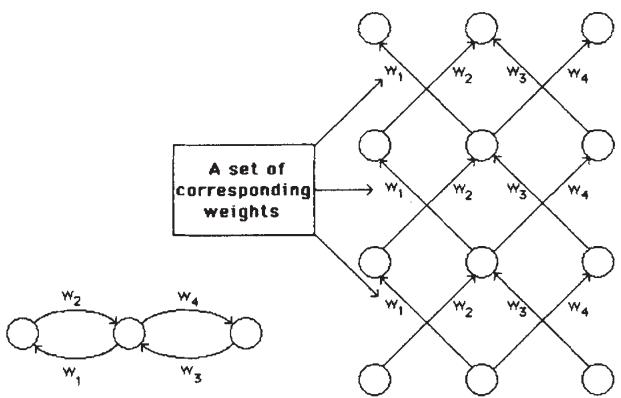

# Paper Collection — AI Foundational Works

本文档总结了人工智能领域的两篇奠基性论文，这些论文通过 MinerU Precision API 解析，并由 opencode omo sisyphus agent 分析。每篇论文条目包括作者背景、文章概览、关键概念解释，以及带有嵌入图像的逐图详细说明。

> **处理说明**：所有 PDF 均使用 MinerU Precision API（vlm backend, language=en）解析。图示说明根据图注、周边文本以及论文内部交叉引用推断，而不是基于像素级图像读取。来源标签：`[FROM CAPTION]` = 逐字来自图注，`[FROM TEXT]` = 来自讨论该图的正文段落，`[FROM TABLE]` = 来自表格内容，`[INFERRED]` = 在没有直接文本支持的情况下根据上下文推断。

---

## 1. Attention Is All You Need

### Bibliographic Information

- **Title**: Attention Is All You Need
- **Venue**: Advances in Neural Information Processing Systems (NeurIPS) 2017
- **Authors**: Ashish Vaswani, Noam Shazeer, Niki Parmar, Jakob Uszkoreit, Llion Jones, Aidan N. Gomez, Łukasz Kaiser, Illia Polosukhin
- **Citation count**: 150,000+（截至 2026 年，是 AI 历史上引用次数最高的论文之一）

### 作者信息

| 作者                       | 所属机构（发表时）             | 背景与学术圈                                                                                                                                                                                                                                                                                       |
| ------------------------ | --------------------- | -------------------------------------------------------------------------------------------------------------------------------------------------------------------------------------------------------------------------------------------------------------------------------------------- |
| **Ashish Vaswani**\*     | Google Brain          | **南加州大学（USC）** 计算机科学博士（2014）。Google Brain 研究科学家（2016–2021），Transformer 工作即在此期间完成。后联合创立 **Adept AI Labs**（2022，首席科学家）及 **Essential AI**（2023，CEO），打造由 Google、Nvidia 和 AMD 支持的企业 AI 工具。[Wikipedia](https://en.wikipedia.org/wiki/Ashish_Vaswani)                                               |
| **Noam Shazeer**\*       | Google Brain          | 就读于 **杜克大学**（1994–1998）。2000 年加入 Google，编写了 Google 搜索拼写纠错器及驱动 AdSense 的 PHIL 算法。在 Google Brain 期间设计了 Transformer 的多头注意力机制、残差架构及首个可运行实现。合著 T5、LaMDA、MoE。联合创立 **Character.AI**（2021，CEO）；2024 年 8 月回归 Google 担任 **工程 VP 兼 Gemini 联合负责人**。[个人网站](https://www.noamshazeer.com/)                  |
| **Niki Parmar**\*        | Google Research       | 浦那计算机技术学院 BE，**USC** 计算机科学硕士。2015 年加入 Google Research，2017 年加入 Google Brain——最年轻且唯一非博士合著者。合著 Image Transformer、Conformer（语音识别）及视觉独立自注意力。联合创立 **Adept AI**（CTO，2021）、**Essential AI**（2023）。2025 年 1 月起任 **Anthropic** 技术成员。[The Org](https://theorg.com/org/anthropic/org-chart/niki-parmar) |
| **Jakob Uszkoreit**\*    | Google Research       | 德国计算机科学家，**柏林工业大学** 硕士（2007）。2008 年加入 Google，从事 Google Translate 工作；在 Google Brain 工作 13 年，为 Google Assistant 构建语言理解系统。2021 年联合创立 **Inceptive**，利用深度学习和高通量生物化学进行 RNA 药物设计。[个人网站](http://jakob.uszkoreit.net/)                                                                                |
| **Llion Jones**\*        | Google Research       | 英国研究员，**伯明翰大学** AI & CS 学士及高级计算机科学硕士。在 Google Research 东京工作十余年（2015–2023）。2023 年联合创立 **Sakana AI**（CTO），一家位于东京、开发受自然启发的非 Transformer AI 架构的初创公司。[TEDAI SF](https://tedai-sanfrancisco.ted.com/panelists/2025/llion-jones/)                                                                   |
| **Aidan N. Gomez**\* †   | University of Toronto | 加拿大人，多伦多大学计算机科学学士（导师 Roger Grosse），**牛津大学** 博士（导师 Yarin Gal 与 Yee Whye Teh）。2017 年作为 Google Brain 实习生（约 20 岁）合著本文。2019 年联合创立 **Cohere**（CEO），一家领先的企业 LLM 公司。担任 **Rivian** 董事会成员。[个人网站](https://aidangomez.ca/)                                                                               |
| **Łukasz Kaiser**\*      | Google Brain          | 波兰研究员，**亚琛工业大学** 博士（2008），弗罗茨瓦夫大学硕士。在巴黎狄德罗大学任终身研究员（逻辑与自动机理论）后，加入 Google Brain（2013–2021），合著 TensorFlow、Tensor2Tensor、Trax。现为 **OpenAI** 高级研究科学家，联合发明推理模型（o1、o3）、GPT-4、GPT-5。[Stanford NLP](https://nlp.stanford.edu/seminar/details/lkaiser.shtml)                                           |
| **Illia Polosukhin**\* ‡ | Google Research       | 乌克兰裔，就读于哈尔科夫理工学院。Google（2014–2017），**TensorFlow** 主要贡献者，管理 Google 搜索问答团队。联合创立 **NEAR Protocol**，一个分片 PoS 区块链平台（2020 主网上线），担任 CTO，目前构建去中心化 AI 基础设施。[Wikipedia](https://en.wikipedia.org/wiki/Illia_Polosukhin)                                                                                |

\* 同等贡献。† 在 Google Brain 实习期间完成的工作。‡ 在 Google Research 任职期间完成的工作。

**协作圈层**：这篇论文诞生于 Mountain View 的 Google Brain 机器翻译团队，该团队此前已经产出了 GNMT 系统 [38] 和 Tensor2Tensor 训练框架。作者们后来的发展轨迹显示，他们分散进入了多家重要 AI 公司（Character.AI, Cohere, Adept AI, Sakana AI, Inceptive），甚至进入相邻领域（区块链中的 NEAR Protocol），这说明这一次合作产生了极其深远的影响。

### Article Overview

论文提出了 **Transformer**，这是一种神经网络架构，用自注意力（Self-Attention）机制完全取代循环层和卷积层。Transformer 同时处理序列中的所有位置（非顺序处理），从而在训练期间实现大规模并行化。在 WMT 2014 英德翻译任务上，Transformer 达到 28.4 BLEU（比此前所有模型，包括集成模型，高出 2+ BLEU）。在英法翻译任务上，它仅使用 8 块 GPU 训练 3.5 天就达到 41.8 BLEU。论文还证明 Transformer 可以泛化到英语成分句法分析，表明该架构并不限于翻译任务。

### Keywords

- **Self-Attention** — 自注意力（Self-Attention）是一种机制，它通过将序列中每个位置与所有其他位置比较，计算输入序列的加权表示，并以 $O(1)$ 顺序操作捕获全局依赖。
- **Multi-Head Attention** — 多头注意力（Multi-Head Attention）在同一输入的不同学习线性投影上并行运行多个注意力操作（heads），使模型能够同时关注不同的表示子空间。
- **Positional Encoding** — 位置编码（Positional Encoding）：由于 Transformer 没有循环或卷积，它通过向输入嵌入添加正弦函数（不同频率的 sine/cosine 波）来注入序列顺序信息。
- **Encoder-Decoder Architecture** — 编码器-解码器架构（Encoder-Decoder Architecture）：编码器将输入序列映射为连续表示；解码器以自回归方式一次生成一个输出 token，并在每一步关注编码器输出。
- **Scaled Dot-Product Attention** — 缩放点积注意力（Scaled Dot-Product Attention）：论文使用的具体注意力变体，即 query 与 key 向量的点积，并按 $1/\sqrt{d_k}$ 缩放，以防止过大的点积使 softmax 饱和。
- **Residual Connections & Layer Normalization** — 残差连接与层归一化（Residual Connections & Layer Normalization）：每个子层之后使用的架构技术：$\text{LayerNorm}(x + \text{Sublayer}(x))$，使深层网络能够稳定训练。

### Key Concepts Explained

#### 1. Why Replace Recurrence?

循环网络（LSTMs, GRUs）逐步处理序列：时间 $t$ 的隐藏状态依赖于时间 $t-1$ 的隐藏状态。这会产生顺序瓶颈：每个位置都必须等待前一个位置完成，从而阻止并行化。Transformer 通过同时计算所有位置之间的注意力打破了这一限制。如 Table 1 所示，循环层需要 $O(n)$ 顺序操作（$n$ = 序列长度），而自注意力只需要 $O(1)$。这使长序列训练显著加快。`(§1 Introduction; §3.2 Attention)`

#### 2. The Attention Mechanism (Mathematical Intuition)

注意力是一种可微的键值查找。每个 “query” 向量 $Q$ 通过点积与所有 “key” 向量 $K$ 比较。得到的分数被缩放并经过 softmax 归一化，生成注意力权重，然后这些权重对 “value” 向量 $V$ 加权。公式（Equation 1）：

$$
\text{Attention}(Q, K, V) = \text{softmax}\left(\frac{QK^T}{\sqrt{d_k}}\right)V \tag{1}
$$

缩放因子 $\sqrt{d_k}$ 至关重要：如果没有它，较大的 $d_k$ 会产生非常大的点积，把 softmax 推入梯度极小的区域（作者指出，对于大的 $d_k$，加性注意力优于未缩放的点积注意力）。`(§3.2.1 Scaled Dot-Product Attention)`

#### 3. Multi-Head Attention: Why 8 Heads?

作者没有使用一次拥有完整维度 keys/values/queries 的单一注意力操作，而是使用不同的学习投影将输入投影 $h=8$ 次，投影到较低维子空间（$d_k = d_v = 64$，其中 $d_{\text{model}} = 512$）。每个 head 关注输入的不同方面。例如，有些 head 关注句法关系，有些关注长距离依赖，还有一些关注照应关系（代词消解）。各个 head 的输出被拼接后再线性投影回去。由于每个 head 的维度按比例降低，这在计算上与单头注意力相近，但表达能力在质上更丰富。`(§3.2.2 Multi-Head Attention)`

$$
\text{MultiHead}(Q, K, V) = \text{Concat}(\text{head}_1, \ldots, \text{head}_h) W^O
$$

$$
\text{where } \text{head}_i = \text{Attention}(QW_i^Q, KW_i^K, VW_i^V)
$$

#### 4. Positional Encoding: Sine Waves as Position Signals

没有循环结构时，模型本身没有 token 顺序感。作者将正弦位置编码直接加到输入嵌入上：

$$
PE_{(pos, 2i)} = \sin(pos / 10000^{2i/d_{\text{model}}})
$$

$$
PE_{(pos, 2i+1)} = \cos(pos / 10000^{2i/d_{\text{model}}})
$$

每个维度对应不同频率的正弦波（波长从 $2\pi$ 到 $10000 \cdot 2\pi$）。关键洞见是：对于任何固定偏移 $k$，$PE_{pos+k}$ 都可以表示为 $PE_{pos}$ 的线性函数（使用三角恒等式），这在假设上有助于模型学习按相对位置进行注意力分配。实验中，学习式位置嵌入表现相近。`(§3.5 Positional Encoding)`

#### 5. Residual Dropout and Label Smoothing

论文使用了两种正则化技术。**Residual Dropout**（base model 中 rate 0.1）：dropout 应用于每个子层的输出，在其加入残差连接之前（即在 $\text{LayerNorm}(x + \text{Dropout}(\text{Sublayer}(x)))$ 之前）。Dropout 也应用于 embedding 与 positional encoding 的和。**Label Smoothing**（$\epsilon_{ls} = 0.1$）：模型不是在硬 0/1 目标上训练，而是学习预测略微软化的分布。这会损害训练困惑度（模型变得不那么“自信”），但会提升 BLEU 分数，因为它防止过度自信。`(§5.4 Regularization)`

#### 6. Training Regime and Scale

- **Data**: WMT 2014 English-German（4.5M 句对，使用 37K 共享词表进行 byte-pair encoding）；English-French（36M 句子，32K word-piece vocabulary）。
- **Hardware**: 8 NVIDIA P100 GPUs，base model 12 小时，big model 3.5 天。
- **Optimizer**: Adam，配合自定义学习率调度（前 4000 步线性 warmup，之后按平方根倒数衰减）：

$$
lrate = d_{\text{model}}^{-0.5} \cdot \min(step\_num^{-0.5}, step\_num \cdot warmup\_steps^{-1.5}) \tag{3}
$$

- 论文以 FLOPs 估计训练成本，显示 Transformer 的训练成本约比可比循环模型低 ~50×（Table 2）。`(§5 Training)`

### Tables

#### Table 1 — Computational Complexity Comparison

| Layer Type                  | Complexity per Layer     | Sequential Ops | Max Path Length |
| --------------------------- | ------------------------ | -------------- | --------------- |
| Self-Attention              | $O(n^2 \cdot d)$         | $O(1)$         | $O(1)$          |
| Recurrent                   | $O(n \cdot d^2)$         | $O(n)$         | $O(n)$          |
| Convolutional               | $O(k \cdot n \cdot d^2)$ | $O(1)$         | $O(\log_k(n))$  |
| Self-Attention (restricted) | $O(r \cdot n \cdot d)$   | $O(1)$         | $O(n/r)$        |

`[FROM TABLE]` 该表解释了 Transformer 架构选择的合理性。自注意力在任意两个位置之间实现常数路径长度（最有利于学习长距离依赖）和常数顺序操作（最有利于并行化），代价是相对于序列长度的二次复杂度。`(§4 Why Self-Attention)`

#### Table 2 — BLEU Scores and Training Cost

`[FROM TABLE]` Transformer (big) 在 EN-DE 上达到 28.4 BLEU（此前最佳 ensemble：26.36），在 EN-FR 上达到 41.8 BLEU（此前最佳单模型：ConvS2S with Mixture-of-Experts 的 40.56）。base Transformer model 的训练成本（$3.3 \times 10^{18}$ FLOPs）约为最佳 ensemble model 的 1/50。`(§6.1 Machine Translation)`

#### Table 3 — Architecture Variations (Ablation Study)

`[FROM TABLE]` (§6.2) 行 (A)：在保持总计算量不变的情况下改变 attention heads 数量。单头注意力（$h=1$, $d_k=512$）比 8-head base model 低 0.9 BLEU，证实了多头机制的收益。过多 head（$h=32$, $d_k=16$）也会降低质量。行 (B)：降低 attention key 维度 $d_k$ 会损害性能。行 (C) 和 (D)：更大的模型（更多层、更宽维度）提升 BLEU。Dropout 至关重要，没有它时，更大的模型会过拟合。行 (E)：学习式位置嵌入与正弦位置嵌入表现几乎相同。

#### Table 4 — Constituency Parsing Results

`[FROM TABLE]` (§6.3) 4-layer Transformer 仅使用 WSJ training set，在 WSJ Section 23 上达到 91.3 F1，优于 Berkeley Parser（90.4）。在半监督设置中（额外 17M 句子），它达到 92.7 F1，接近 Recurrent Neural Network Grammar（93.3）。这表明 Transformer 可以泛化到翻译之外的任务。

### Figures — Detailed Explanations

#### Figure 1: The Transformer — Model Architecture

**Caption** `[FROM CAPTION]`: "Figure 1: The Transformer — model architecture."

**Analysis** `[INFERRED]` (§3, §3.1): 这是论文中具有标志性的架构图。左半部分显示 Encoder stack，右半部分显示 Decoder stack，两者通过 cross-attention 箭头连接。

**Encoder**（左）：输入 token 先经过 embedding layer，再经过 positional encoding，然后通过 $N=6$ 个相同层。每个 encoder layer 有两个子层：(1) Multi-Head Self-Attention，(2) Feed-Forward Network。两个子层都包裹在残差连接中，随后进行 layer normalization：$\text{LayerNorm}(x + \text{Sublayer}(x))$。

**Decoder**（右）：同样有 $N=6$ 个相同层，但每层有三个子层：(1) Masked Multi-Head Self-Attention（通过 mask 防止关注未来位置），(2) 对 encoder output 的 Multi-Head Cross-Attention，(3) Feed-Forward Network。输出随后经过 linear layer 和 softmax，生成 token 概率。

该图使用颜色编码表示数据流：底部的 embedding vectors、向上流经各层的中间表示、残差连接（旁路箭头），以及从 encoder 到 decoder 的 cross-attention connection。

**Key detail from text** `[FROM TEXT]` (§3.1): 所有子层都产生维度为 $d_{\text{model}} = 512$ 的输出。decoder 的 self-attention 被 masked（future positions 在 softmax 前被设为 $-\infty$），以保持自回归性质，即位置 $i$ 的预测只能依赖于位置 $< i$ 的已知输出。

**Uncertainty**: 如果不读取像素，无法确认确切的视觉布局（框的位置、颜色、箭头方向、子层框内标签）。残差连接附近存在 “Add & Norm” 标签是根据文本描述推断的。

---

#### Figure 2: Scaled Dot-Product Attention and Multi-Head Attention

**Caption** `[FROM CAPTION]`: "Figure 2: (left) Scaled Dot-Product Attention. (right) Multi-Head Attention consists of several attention layers running in parallel."

**Left Panel — Scaled Dot-Product Attention** `[INFERRED]` (§3.2.1):
这是一个计算图，底部有三个输入（$Q$, $K$, $V$）向上流动。操作顺序为：
1. **MatMul**: $Q$ 和 $K$ 进行矩阵乘法（点积）
2. **Scale**: 结果除以 $\sqrt{d_k}$
3. **Mask** (opt.): 对于 decoder self-attention，future positions 被 mask 为 $-\infty$
4. **SoftMax**: 将分数转换为概率权重
5. **MatMul**: 与 $V$ 的加权和产生输出

**Right Panel — Multi-Head Attention** `[INFERRED]` (§3.2.2):
这里显示 $h$ 个并行的 “Scaled Dot-Product Attention” 块（左图横向重复 $h=8$ 次），每个块接收各自线性投影后的 $Q$, $K$, $V$。流程如下：
1. $V$, $K$, $Q$ 从底部进入
2. 每个输入通过 $h$ 个独立的 **Linear** 投影（学习得到的权重矩阵 $W_i^Q, W_i^K, W_i^V$）
3. 每个投影后的三元组进入单独的 **Scaled Dot-Product Attention** 块
4. $h$ 个输出被 **Concat**enated
5. 最终的 **Linear** 投影（$W^O$）产生输出

**Key detail from text** `[FROM TEXT]` (§3.2.2): 每个 head 的维度为 $d_k = d_v = d_{\text{model}} / h = 64$（其中 $d_{\text{model}} = 512$ 且 $h = 8$）。这保证总计算成本与单头注意力相近。

**Cross-reference** `[FROM TEXT]` (§3.2.3): Figure 2 的 attention mechanism 在 Transformer 中以三种方式使用：encoder self-attention、decoder self-attention（masked），以及 encoder-decoder cross-attention。

> **Appendix Figures 3–5 (not shown)**: 论文附录包含三幅注意力可视化图，展示单个 attention heads 学到可解释的语言功能：长距离依赖消解（Figure 3）、照应消解（Figure 4）和句法结构检测（Figure 5）。这些图出现在原论文参考文献之后。仓库内置示例仅保留正文展示图片；重新生成报告时，附录图片会出现在运行时 `mineru/<paper-slug>/images/` 文件夹中。

---

## 2. Learning Representations by Back-Propagating Errors

### Bibliographic Information

- **Title**: Learning representations by back-propagating errors
- **Venue**: Nature, Volume 323, Issue 6088, pages 533–536
- **Date**: Published 9 October 1986 (received 1 May, accepted 31 July 1986)
- **Authors**: David E. Rumelhart\*, Geoffrey E. Hinton†, Ronald J. Williams\*
- **DOI**: [10.1038/323533a0](https://doi.org/10.1038/323533a0)

\* Institute for Cognitive Science, University of California, San Diego (UCSD)
† Department of Computer Science, Carnegie-Mellon University (CMU)

> **解析质量说明**：MinerU 对该 PDF 的解析包含了反向传播论文前后相邻 Nature 文章中的文本。反向传播论文是 Nature 中一篇 4 页的 “Letter”，位于第 533–536 页。在 Nature 的印刷排版中，“Letters to Nature” 栏目会把多篇 letter 排在同一物理页面上，因此第 536 页底部与一篇关于化石骨骼氨基酸外消旋测年的地球化学论文共享。当该页被扫描/复印成 PDF 时，两篇论文都被捕获了。前部噪声（`full.md` 的 lines 1–56）包含对 Bada、Engel 和 Macko 的引用（他们是地球化学家，而不是神经网络研究者）。后部噪声（lines 291–344）来自 Murphy & Mitchell 关于小猫双侧弱视的神经科学论文。实际的反向传播内容从 line 57 开始，大约在 line 289 结束。下面的分析只关注反向传播内容。
>
> **重要区分**：作者还在 PDP book（MIT Press, 1986, pp. 318–362）中发表过一章长得多（45 页）的章节，题为 “Learning Internal Representations by Error Propagation”。该章节包含 XOR problem experiments，并带有额外的网络图（XOR architecture、learned XOR weights、local minimum visualization），这些内容**不在** Nature 论文中。Nature 论文是一个压缩版本，展示的是 symmetry detection、family tree 和 recurrent network equivalence 实验。下面五幅图仅对应 Nature 论文。
>
> **历史优先性说明**：核心数学技术（reverse-mode automatic differentiation / chain rule through computational graphs）曾被多次独立发现。Seppo Linnainmaa 在其 1970 年硕士论文中发表了自动微分的反向模式。Paul Werbos 在其 1974 年 Harvard 博士论文中提出将其应用于神经网络。Rumelhart-Hinton-Williams 论文之所以具有历史意义，是因为它在有趣问题上展示了该技术的实际有效性，并发表在 Nature 上，触达了广泛的科学受众，从而有效触发了 1986–1991 年的 “connectionist revolution”。

### 作者信息

| 作者 | 所属机构（发表时） | 背景与学术圈 |
|---|---|---|
| **David E. Rumelhart** (1942–2011)\* | Institute for Cognitive Science, UCSD | 美国心理学家，南达科他大学心理学与数学学士（1963），**斯坦福大学** 数学心理学博士（1967）。先后任教于 UCSD 和斯坦福大学。1982 年春独立开发了反向传播算法。领导了 **Parallel Distributed Processing (PDP) 研究组**，催化了连接主义革命。与 James McClelland 合著里程碑式的两卷本 *PDP*（1986）。麦克阿瑟奖得主（1987），美国国家科学院院士。著名博士生：Michael I. Jordan。年度 **Rumelhart Prize**（$100,000）纪念其学术遗产。2011 年因进行性神经系统疾病去世。[Wikipedia](https://en.wikipedia.org/wiki/David_Rumelhart) |
| **Geoffrey E. Hinton** (b. 1947)† | Carnegie-Mellon University | 英裔加拿大人，**剑桥大学** 实验心理学学士（1970），**爱丁堡大学** 人工智能博士（1978）。UCSD 博士后，CMU 任教（1982–1987），后移职至 **多伦多大学**（1987 至今，名誉教授）。**Google** VP 兼 Engineering Fellow（2013–2023）。被誉为 "AI 教父"。贡献涵盖 Boltzmann machines、深度信念网络、dropout、AlexNet（2012 ImageNet 突破）。**2018 年 ACM 图灵奖**（与 Bengio 和 LeCun 共享）及 **2024 年诺贝尔物理学奖**（与 John Hopfield 共享）。其学术后代（Sutskever、LeCun、Krizhevsky 等）构成现代深度学习的核心力量。2023 年因 AI 安全担忧离开 Google。[UofT Bio](https://www.cs.utoronto.ca/~hinton/bio.html) |
| **Ronald J. Williams** (1945–2024)\* | Institute for Cognitive Science, UCSD | 美国数学家，**加州理工学院** 数学学士（1966），**UCSD** 数学博士（1975）。在加入 Rumelhart 的 PDP group（1983–1986）前从事反潜战算法研究。**东北大学** 计算机科学教授（1986 年起）。奠基性贡献：**REINFORCE algorithm**（1992）——强化学习中第一个策略梯度方法，现为现代 LLM 中 RLHF 的基础；teacher forcing（与 Zipser 合作）；backpropagation through time。2024 年 2 月 16 日去世，享年 79 岁。[Wikipedia](https://en.wikipedia.org/wiki/Ronald_J._Williams) |

**圈层与背景**：这项工作诞生于 1980 年代中期以 UC San Diego 为中心的 Parallel Distributed Processing (PDP) research group。PDP group 是对当时占主导地位的符号 AI 路线（rule-based systems, expert systems）的一种反向运动。Rumelhart 和 McClelland 的两卷本 PDP book（1986）是该群体的宣言。反向传播论文是该群体产出的若干里程碑成果之一，其他成果还包括词识别的 interactive activation model，以及 Hinton 和 Sejnowski 对 Boltzmann machines 的发展。

这篇论文作为一篇简短的 “letter” 发表在 Nature 上，这一格式选择让它获得了远超神经网络社区的可见度。它与 PDP books 一起触发了有时被称为 1986–1991 年 “connectionist revolution” 的浪潮；这股浪潮在 1990 年代中期曾被统计机器学习（SVMs, graphical models）短暂遮蔽，直到 2010 年代深度学习复兴。

**网络联系**：这两个论文群体在历史上存在联系：Aidan Gomez（Transformer 论文）在 Google Brain 时曾受 Geoffrey Hinton 指导，而 Hinton 指导过 Ilya Sutskever，后者共同创立了 OpenAI；Łukasz Kaiser 现在则在 OpenAI 担任 senior research scientist，并参与共同发明 GPT-4, o1, and o3。

### Article Overview

论文描述了用于多层神经网络的**反向传播学习算法（back-propagation learning algorithm）**。它解决的关键问题是：在包含 hidden units 的网络中，权重应如何调整？这些 hidden units 的期望输出状态并没有由训练数据指定。算法分两个阶段工作。在**前向传播（forward pass）**中，输入信号逐层通过网络传播，产生输出。在**反向传播（backward pass）**中，计算实际输出与期望输出之间的误差，然后使用微积分链式法则将误差反向传播通过网络，计算误差相对于每个权重的偏导数。随后通过梯度下降调整权重：

$$\Delta w = -\varepsilon \frac{\partial E}{\partial w} \tag{8}$$

可选地加入 momentum term：

$$\Delta w(t) = -\varepsilon \frac{\partial E}{\partial w}(t) + \alpha \Delta w(t-1) \tag{9}$$

论文在三个任务上展示了该算法：
1. **Mirror symmetry detection** — 一个需要 hidden units 的问题，因为单独的输入特征不能提供关于对称性的证据。
2. **Family tree knowledge representation** — 从三元组中学习关系（father, mother, aunt 等），展示 hidden units 会发展出对领域结构有意义的分布式表示。
3. **Mapping to recurrent/iterative networks** — 展示分层反向传播过程如何适配 recurrent networks。

### Keywords

- **Back-Propagation** — 反向传播（Back-Propagation）是一种算法，通过从输出层到输入层递归应用链式法则，计算误差函数相对于网络权重的梯度。
- **Hidden Units** — 隐藏单元（Hidden Units）是中间层中的神经元，其目标状态不由训练数据指定。它们学习表示输入领域中的有用特征。
- **Gradient Descent** — 梯度下降（Gradient Descent）是一种优化方法，沿误差函数最陡下降方向调整权重。
- **Error Surface** — 误差曲面（Error Surface）是误差作为所有网络权重函数的多维景观。梯度下降在该曲面上导航；局部极小值是潜在陷阱。
- **Momentum** — 动量（Momentum）是一种加速技术（$\Delta w(t) = -\varepsilon \partial E/\partial w + \alpha \Delta w(t-1)$），它平滑权重变化，并帮助逃离浅层局部极小值。
- **Distributed Representations** — 分布式表示（Distributed Representations）不是每个概念使用一个单元（local representation），而是将概念编码为多个单元活动模式。family tree task 中的 hidden units 学到诸如 “generation” 和 “family branch” 的分布式特征。
- **The Generalized Delta Rule** — 广义 Delta 规则（The Generalized Delta Rule）是多层网络的权重更新规则，将单层感知机的 delta rule（Widrow-Hoff）推广到多层网络。

### Key Concepts Explained

#### 1. The Problem with Hidden Units

在感知机（单层网络）中，输入单元直接连接到输出单元，所有单元的期望状态都是已知的。学习很直接：按 $(\text{desired} - \text{actual}) \times \text{input}$ 的比例调整权重。然而，当存在中间（hidden）层时，我们不知道给定输入下 hidden unit activations *应该*是什么。hidden units 会发展出自己的表示，但我们需要一种方法，将输出误差的功劳/责任分配回这些 hidden units。`(§1, Introduction paragraph)`

#### 2. The Chain Rule Solution

突破点在于应用微积分链式法则。对于连接 unit $i$ 到 unit $j$ 的每个权重 $w_{ji}$：

$$\frac{\partial E}{\partial w_{ji}} = \frac{\partial E}{\partial x_j} \cdot \frac{\partial x_j}{\partial w_{ji}} = \frac{\partial E}{\partial x_j} \cdot y_i \tag{6}$$

其中 $\partial E / \partial x_j$（误差相对于 unit $j$ 总输入的导数）可以这样计算：
- 对于 output units：

$$\partial E / \partial x_j = (y_j - d_j) \cdot y_j (1 - y_j) \tag{5}$$

- 对于 hidden units：

$$\partial E / \partial y_i = \sum_j \left( \partial E / \partial x_j \cdot w_{ji} \right) \tag{7}$$

Equation 7 的关键洞见是：hidden unit 的误差导数是**它所连接到的各个单元误差导数的加权和**，权重由连接权重给出。这使误差能够逐层向后传播。`(§Backward pass, Equations 4–7)`

#### 3. The Sigmoid Nonlinearity

论文使用 logistic sigmoid function：

$$y_j = \frac{1}{1 + e^{-x_j}} \tag{2}$$

这非常关键，因为：
- 它可微（梯度计算所必需）
- 它的导数形式简单：$dy/dx = y(1-y)$，使计算高效（Equation 5）
- 它被限制在 0 和 1 之间，防止激活无界增长

作者指出：“It is not necessary to use exactly the functions given in equations (1) and (2). Any input-output function which has a bounded derivative will do.” 这预示了后来 tanh、ReLU 和其他 activation functions 的使用。

#### 4. The Forward Pass

unit $j$ 的总输入 $x_j$ 是连接到 $j$ 的各单元输出 $y_i$ 及这些连接上的权重 $w_{ji}$ 的线性函数：

$$x_j = \sum_i y_i w_{ji} \tag{1}$$

可以通过为每个单元引入一个始终取值为 1 的额外输入来提供 biases。该额外输入上的权重称为 bias，它等价于符号相反的 threshold。`(§Forward pass)`

#### 5. The Error Function

总误差 $E$ 定义为：

$$E = \frac{1}{2} \sum_c \sum_j (y_{j,c} - d_{j,c})^2 \tag{3}$$

其中 $c$ 是 cases（input-output pairs）的索引，$j$ 是 output units 的索引，$y$ 是 output unit 的实际状态，$d$ 是其期望状态。因子 $1/2$ 是为了数学方便（对平方求导时会抵消）。`(§Error function)`

#### 6. Momentum and Batch vs. Online Learning

论文描述了两种权重更新策略：
- **Online**: 每个 training case 后更新权重。“No separate memory is required for the derivatives.”
- **Batch**: 在所有 cases 上累积 $\partial E / \partial w$，然后一次性改变权重。这也是实验所采用的方式。

动量加速（Equation 9）被描述为能显著改善收敛，“without sacrificing the simplicity and locality” of gradient descent。使用 momentum（$\alpha \approx 0.9$）时，当前梯度改变的是权重更新的速度而不是位置，从而能够更快穿过 error surface 中的狭谷。`(§Backward pass, Equations 8–9)`

#### 7. Why Back-Propagation Matters (Then and Now)

在论文发表时（1986 年），它回应了神经网络的一项核心批评：多层网络无法训练，因为没有 hidden units 的学习规则。Minsky 和 Papert 1969 年的著作 “Perceptrons” 从数学上证明了单层网络的局限性，并认为 “no reason to suppose” 多层网络能够被训练。反向传播算法提供了缺失的学习规则，直接回应了 Minsky-Papert 的批评。

这一具体技术，即通过链式法则进行梯度下降，现在几乎是所有深度学习的基础。PyTorch 和 TensorFlow 等现代框架实现了自动微分，而自动微分正是反向传播在任意计算图上的计算泛化。

#### 8. Local Minima: The "Surprisingly Rare" Barrier

论文坦率承认主要理论顾虑：“the error-surface may contain local minima so that gradient descent is not guaranteed to find a global minimum.” 然而，作者的经验观察非常醒目：“experience with many tasks shows that the network very rarely gets stuck in poor local minima.” 他们假设，增加更多连接会在权重空间中创造额外维度，从而 “provide paths around the barriers.” 这一经验观察极具预见性：在过参数化网络中，有害局部极小值的有效缺失，如今已是深度学习理论中的重要研究主题（“loss landscape” 文献）。`(§Conclusion paragraph)`

#### 9. The Biologically Plausible Question

论文非常诚实：“The learning procedure, in its current form, is not a plausible model of learning in brains.” 反向传播需要与前向传播相同的权重（weight symmetry），并且误差导数必须以数学精度计算。然而，作者将反向传播定位为概念验证：“this suggests that it is worth looking for more biologically plausible ways of doing gradient descent in neural networks.” 这种对工程有效性与生物合理性的谨慎区分，对于论文在认知科学社区中的接受非常重要。`(§Final paragraph)`

### Figures — Detailed Explanations

#### Figure 1: Mirror Symmetry Detection Network

**Caption** `[FROM CAPTION]`: "Fig. 1 A network that has learned to detect mirror symmetry in the input vector. The numbers on the arcs are weights and the numbers inside the nodes are biases. The learning required 1,425 sweeps through the set of 64 possible input vectors, with the weights being adjusted on the basis of the accumulated gradient after each sweep. The values of the parameters in equation (9) were $\varepsilon = 0.1$ and $\alpha = 0.9$. The initial weights were random and were uniformly distributed between $-0.3$ and $0.3$."

**Analysis** `[FROM CAPTION]`: 该图展示了一个小型神经网络，其中包含 input units（表示二进制向量的数组）、两个 hidden units 和一个 output unit。关键洞见在于权重如何编码对称检测逻辑。

图注解释了这个优雅解法：“for a given hidden unit, weights that are symmetric about the middle of the input vector are equal in magnitude and opposite in sign.” 这意味着，如果呈现一个对称模式（例如左半部分镜像右半部分），两个 hidden units 都会从 input units 接收到零净输入。由于 hidden units 有负 bias，它们都会保持 OFF。带有正 bias 的 output unit 会转为 ON，表示对称。

对于非对称模式，一个 hidden unit 会接收到非零输入并转为 ON，从而抑制 output unit。中点两侧的权重比例为 1:2:4，确保中点上方的 8 种可能模式各自产生唯一的激活和，因此 “so the only pattern below the midpoint that can exactly balance this sum is the symmetrical one.”

**Cross-reference** `[FROM TEXT]` (§Results): 选择该任务是因为单层网络无法解决它：“the activity in an individual input unit, considered alone, provides no evidence about the symmetry or non-symmetry of the whole input vector, so simply adding up the evidence from the individual input units is insufficient.” “A more formal proof that intermediate units are required is given in ref. 2”（Minsky & Papert, Perceptrons, 1969）。

---

#### Figure 2: Two Isomorphic Family Trees

**Caption** `[FROM CAPTION]`: "Fig. 2 Two isomorphic family trees. The information can be expressed as a set of triples of the form (person 1) (relationship) (person 2), where the possible relationships are {father, mother, husband, wife, son, daughter, uncle, aunt, brother, sister, nephew, niece}. A layered net can be said to 'know' these triples if it can produce the third term of each triple when given the first two. The first two terms are encoded by activating two of the input units, and the network must then complete the proposition by activating the output unit that represents the third term."

**Analysis** `[FROM CAPTION]`: 该图展示了两棵家族树，一棵 English（包含 Christopher、Penelope、Andrew、Christine 等名字），一棵 Italian（Roberto、Maria、Pierro、Francesca 等）。两棵树结构相同（isomorphic），但具体个体不同。其目的是测试网络是否能学习两棵树背后的关系结构，并在两者之间泛化。

网络在一部分可能的 (person, relationship, ?) triples 上训练。例如，如果训练样本为 (Colin, has-mother, Victoria)，网络应学习 Colin 的 mother 总是 Victoria。但关键在于，如果 Italian tree 中存在结构等价关系（例如 Alfonso has-mother Lucia），网络也应该学习从 English structure 泛化到 Italian structure。

---

#### Figure 3: Activity Levels After Learning

**Caption** `[FROM CAPTION]`: "Fig. 3 Activity levels in a five-layer network after it has learned. The bottom layer has 24 input units on the left for representing ⟨person 1⟩ and 12 input units on the right for representing the relationship. The white squares inside these two groups show the activity levels of the units. There is one active unit in the first group representing Colin and one in the second group representing the relationship 'has-aunt'. Each of the two input groups is totally connected to its own group of 6 units in the second layer. These groups learn to encode people and relationships as distributed patterns of activity. The second layer is totally connected to the central layer of 12 units, and these are connected to the penultimate layer of 6 units. The activity in the penultimate layer must activate the correct output units, each of which stands for a particular ⟨person 2⟩. In this case, there are two correct answers (marked by black dots) because Colin has two aunts. Both the input units and the output units are laid out spatially with the English people in one row and the isomorphic Italians immediately below."

**Analysis** `[FROM CAPTION]`: 这是一张详细的架构图，显示 family tree task 所用 5-layer network 在训练后的实际 activity levels。网络架构为：
- Layer 1 (input, bottom): 24 个 person units + 12 个 relationship units = 36 个 input units
- Layer 2 (first hidden): 两组各 6 个单元（总计 12 个），一组连接 person inputs，另一组连接 relationship inputs
- Layer 3 (central hidden): 12 个单元，来自 layer 2 的全连接
- Layer 4 (penultimate): 6 个单元，连接到 layer 5
- Layer 5 (output, top): 表示所有 24 个可能 persons 的单元（12 English, 12 Italian）

具体示例显示：input = (Colin, has-aunt)。由于 Colin（在 English tree 中）有两个 aunts，网络激活两个对应的 output units（以黑点标记）。English 位于 Italian 上方的空间布局（在 input 和 output layers 中都是如此）是有意设计的，便于视觉检查网络是否以相似方式处理结构等价的人。

---

#### Figure 4: Hidden Unit Receptive Fields (Weight Visualization)

**Caption** `[FROM CAPTION]`: "Fig. 4 The weights from the 24 input units that represent people to the 6 units in the second layer that learn distributed representations of people. White rectangles, excitatory weights; black rectangles, inhibitory weights; area of the rectangle encodes the magnitude of the weight. The weights from the 12 English people are in the top row of each unit. Unit 1 is primarily concerned with the distinction between English and Italian and most of the other units ignore this distinction. This means that the representation of an English person is very similar to the representation of their Italian equivalent. The network is making use of the isomorphism between the two family trees to allow it to share structure and it will therefore tend to generalize sensibly from one tree to the other. Unit 2 encodes which generation a person belongs to, and unit 6 encodes which branch of the family they come from."

**Training details** `[FROM CAPTION]`: "We trained the network for 1500 sweeps, using $\varepsilon = 0.005$ and $\alpha = 0.5$ for the first 20 sweeps and $\varepsilon = 0.01$ and $\alpha = 0.9$ for the remaining sweeps. To make it easier to interpret the weights we introduced 'weight-decay' by decrementing every weight by 0.2% after each weight change."

**Analysis** `[FROM CAPTION]`: 这是论文中最偏向可解释性的图，展示从 24 个 person-input units 到第二层 6 个 hidden units 的连接权重。关键发现如下：

1. **Unit 1**: 编码 English vs. Italian nationality。“Most of the other units ignore this distinction.” 这意味着对于其他特征，hidden representation 对 nationality 不敏感，从而允许跨语言泛化（例如从 English tree data 学习并应用到 Italian tree data）。

2. **Unit 2**: 编码 generation（一个人在 family tree 中属于哪一代）。

3. **Unit 6**: 编码 family branch（该人来自哪个子家族，例如 Christopher/Penelope branch 与 Andrew/Christine branch）。

这些特征 “not at all explicit in the input and output encodings”：输入使用 localist 的 “one unit per person” 方案，因此这些结构化、组合式特征完全是从学习中涌现的。这是论文的核心主张：hidden units 会学习有意义的 distributed representations。

**Cross-reference** `[FROM TEXT]` (§Results): “Because the hidden features capture the underlying structure of the task domain, the network generalizes correctly to the four triples on which it was not trained.”

**The weight-decay technique** `[FROM CAPTION]`: Weight decay（每次更新后将每个权重递减 0.2%）用于可解释性：“After prolonged learning, the decay was balanced by $\partial E/\partial w$, so the final magnitude of each weight indicates its usefulness in reducing the error.” 这是后来深度学习中 L2 regularization 的早期实例之一，不过此处用于可视化，而不是正则化。

---

#### Figure 5: Synchronous Iterative Net = Layered Net

**Caption** `[FROM CAPTION]`: "Fig. 5 A synchronous iterative net that is run for three iterations and the equivalent layered net. Each time-step in the recurrent net corresponds to a layer in the layered net. The learning procedure for layered nets can be mapped into a learning procedure for iterative nets."

**Analysis** `[FROM CAPTION]`: 该图展示了 (a) 运行 3 个时间步的 recurrent network 与 (b) 3 层 feed-forward network 之间的等价性。关键洞见是：可以在时间上 “unroll” 一个 recurrent network，创建一个相同深度的 layered network，然后对展开后的网络应用 back-propagation。这是**通过时间反向传播（back-propagation through time）**（BPTT）的概念祖先，后者后来成为 recurrent neural networks 的标准训练算法。

文中指出两个实际复杂点：
1. “In an iterative net it is necessary to store the history of output states of each unit” — 因为 backward pass 需要 forward pass 中的中间激活。
2. “Corresponding weights between different layers must have the same value” — recurrent weights 在每个时间步共享。解决方案是：对所有对应权重的 $\partial E / \partial w$ 求平均，然后将相同更新应用到每个权重。

**Significance**: 这一映射确立了 back-propagation 可以训练 recurrent networks，为 sequence learning 打开了大门。结尾评论 “These nets can then either learn to perform iterative searches or learn sequential structures” 预示了 RNN/LSTM sequence modeling 会在接下来三十年中主导 NLP，直到 Transformer（本合集中的 Paper 1）使 recurrence 不再必要。

---

## Processing Metadata

- **处理日期**: 2026-05-25
- **解析器**: MinerU Precision API (vlm backend, language=en)
- **Agent**: opencode omo sisyphus
- **源文件**:
  - `Attention Is All You Need.pdf`
  - `Learning representations by back-propagating errors.pdf`
- **MinerU runtime outputs**: 本 skill 仓库不内置运行产物；重新运行时，`full.md`、content-list JSON、图片和 `manifest.json` 会写入用户运行目录下的 `mineru/`。
- **Agent workflow**: 仓库根目录中的 `SKILL.md`
- **处理论文总数**: 2 / 2
